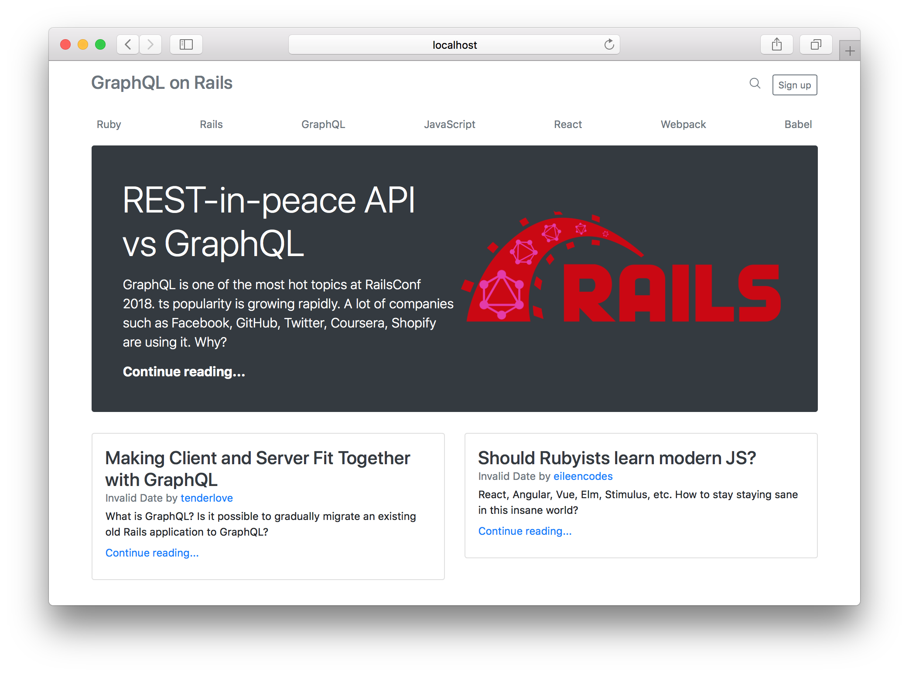

# GraphQL on Rails



## Tech Stack

* Ruby on Rails 5.2
* GraphQL 1.8
* Webpacker 3.4
* React 16.2
* React Apollo 2.1

## Creating the app from scratch

    > brew install yarn
    > gem install rails -v 5.2.0
    > rails new graphql-on-rails --api --webpack=react

## Starting the application

```
> bundle
> bundle exec rails s
```
